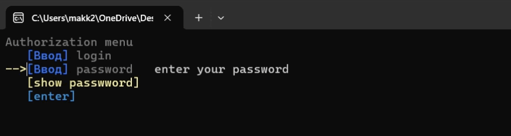

# "Authorization" `example`
[](../README.md)
```cpp
#include "EasyMenu.h"

int main() {
    EasyMenu menu;

    menu.add.text("Authorization menu");
    menu.add.input("login");
    menu.add.input("password").filter(true).secure(true).length(20)
    .notification("enter your password").color(LIGHT_GRAY_COLOR);
    menu.add.button("show passwword").color(LIGHT_YELLOW_COLOR);
    menu.add.button("enter");

    bool secure = true;

    while (true) {
        if (menu.run() == 2) { // clicked "show password" (index = 2)
            if (secure) {
                menu.edit.button(3).name("hide password");
            }
            else {
                menu.edit.button(3).name("show password");
            }
            menu.edit.input(2).secure(secure = !secure);
        }
        else {	// clicked "enter" (index = 3)
            if (menu.get.input(1) == "user" && menu.get.input(2) == "123") {
                menu.notification.add("good authorization", 4).color(GREEN_COLOR);
            }
            else {
                menu.notification.add("wrong login or password!", 4).color(RED_COLOR);
            }
        }
    }
}
```
