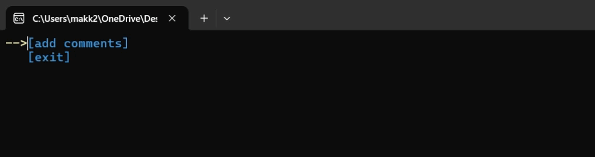

# "Comments" `example`
[](../README.md)
```cpp
#include "EasyMenu.h"

vector<string> AddCommentsMenu() {
	EasyDict dictionary("main_dict");	// save file "main_dict_RD.emd" should be in .exe path
	dictionary.save();

	EasyMenu menu;

	menu.add.input("comment")
		.allowed("qwertyuiopasdfghjklzxcvbnmQWERTYUIOPASDFGHJKLZXCVBNM ()[].?!,1234567890")
		.dictionary(&dictionary)
		.length(80);
	menu.add.button("enter");
	menu.add.button("back").color(BLUE_COLOR);
	menu.add.text("history:");


	vector<string> comments;

	while (true) {
		switch (menu.run())
		{
		case 1:	// "enter"
			if (menu.get.input(0).empty() == false) {
				comments.push_back(menu.get.input(0));
				menu.edit.input(0).origional_text("");
				menu.add.text(comments.back());
			}
			else {
				menu.notification.add("comment is empty!", 0).color(YELLOW_COLOR);
			}
			break;
		case 2:	// "back"
			return comments;
			break;
		}
	}
}


int main() {	// for tests
	EasyMenu menu;

	menu.add.button("add comments");
	menu.add.button("exit");

	while (menu.run() != 1) {
		menu.notification.add("added " + std::to_string(AddCommentsMenu().size()) + " comments!", 0)
			.color(GREEN_COLOR);
	}
}
```
